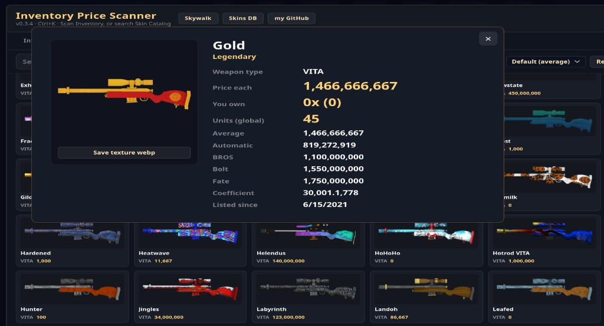
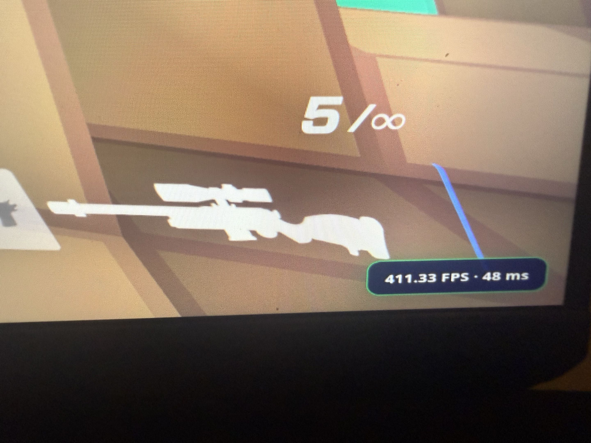

This repo is compiled assets i use for kirka.io and other games, i didnot create a lot of the content inside of this, they are all copied from discord, and other websites. just putting them here for permalinks and also storage.

[Inventory Price Scanner](https://github.com/nnapkin12/napkin-theme-assets/blob/main/Scripts/InventoryPriceScanner.js): From an existing inventory pricing script, i just extended it to have a menu(ctrl+K), with metadata for each item it picks up, aswell as a catalog of all skins to view all of their information.

  

[FPS/Ping Display](https://github.com/nnapkin12/napkin-theme-assets/blob/main/Scripts/FPS-MS-OnScreen.js):

Gives a new look and places FPS/Ping on the bottom right, it uses the already existing fps/ping readouts from kirka, you dont need the kirka HUD on, this script auto reads it.

  

